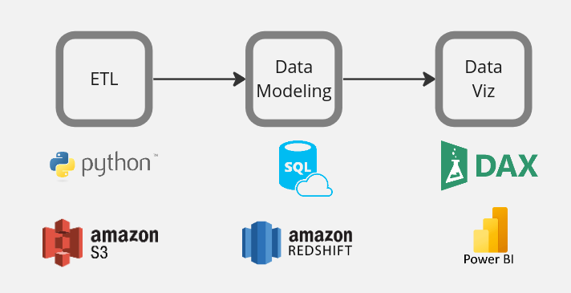
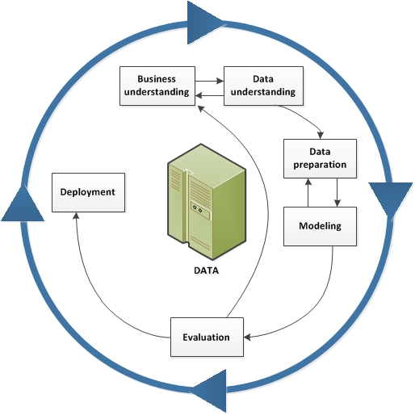
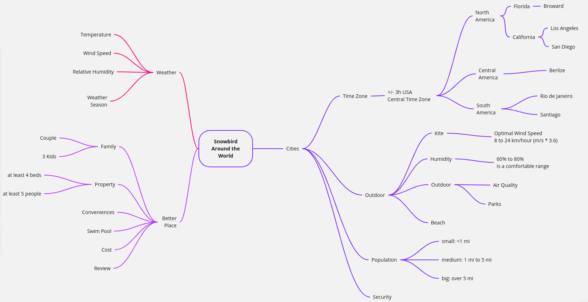
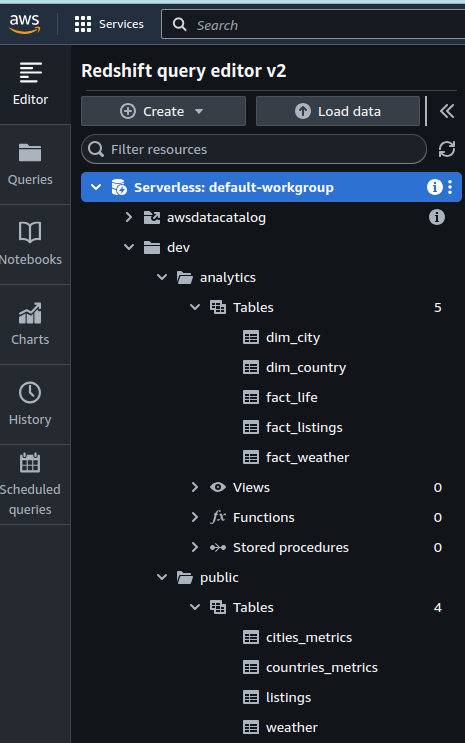
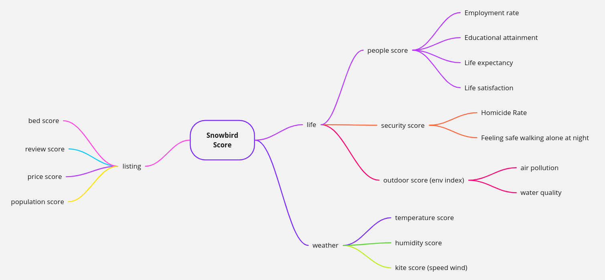
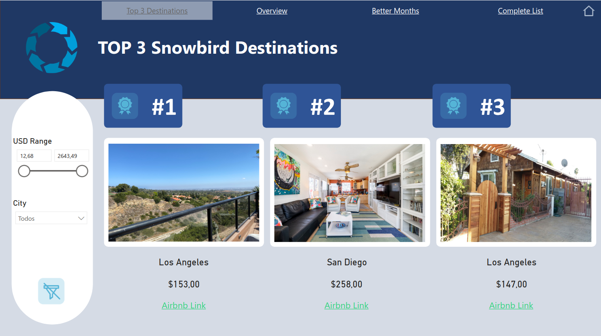
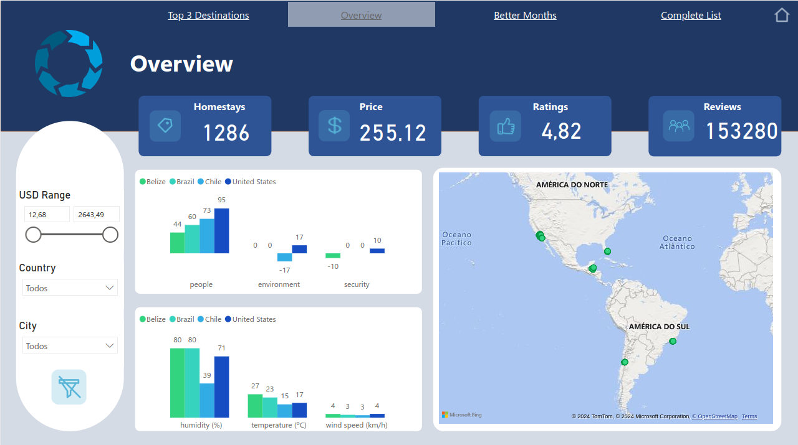
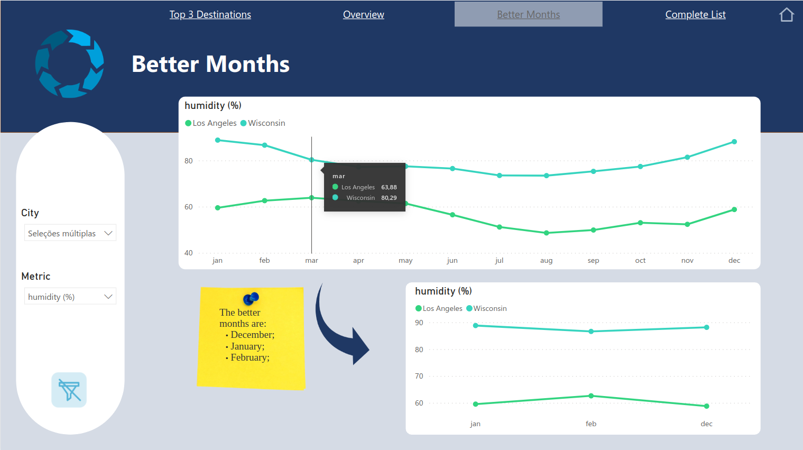
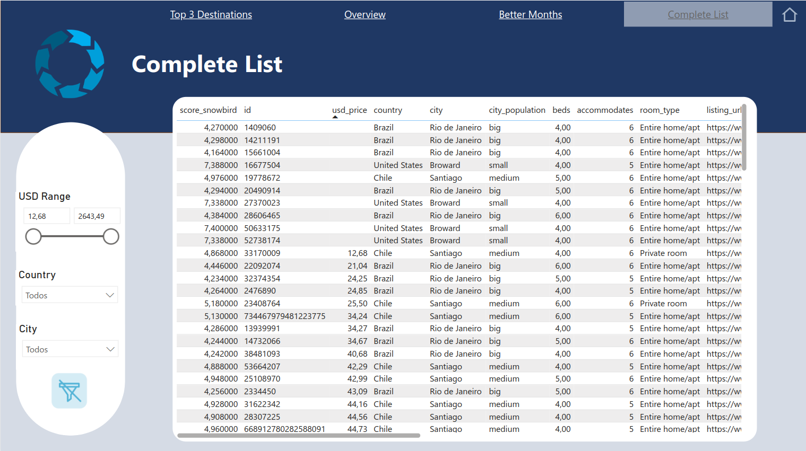

# Snowbird Destinations Analysis

### End-to-End Data Case: from ETL to Dashboard Development.

## 1. Abstract

This case was proposed by [LeadSimple](https://leadsimple.com/) in its selection process for the vacancy of Product Data Analyst. Its main objective is to verify the candidate's proficiency in tools such as Python, SQL, Data Visualization, and Cloud Computing.

For this, an end-to-end data project was developed to present data-driven recommendations on the top 3 places a couple and three children could go during the winter months and how long they should stay there, in a common practice known as Snowbirding.

The project was developed using the data stack below. I used Python scripts to carry out the ETL process, applied SQL in a Data Warehouse on Redshift, performed data modeling, and finally developed the dashboard using Power BI and its native language, DAX.

    

Watch the brief presentation below of the solution developed through a dashboard in Power BI:

    

**Link:* [Dashboard](https://app.powerbi.com/view?r=eyJrIjoiOGRmNWFmMjktOWNhZi00NGEwLTk0YzAtNjQ2OGYxZGVjNmY5IiwidCI6IjgyOWZmMzMyLTMxYmEtNDg0ZC1iNDQ4LWU1NDYxMzE3ZWZjYSJ9)

## 2. Methodology

The CRISP-DM framework was the guide for this data project development. 

CRISP-DM, which stands for Cross-Industry Standard Process for Data Mining, is an industry-proven way to guide your data mining efforts and it includes descriptions of the typical phases of a project, the tasks involved with each phase, and an explanation of the relationships between these tasks.

     

**Source:* [IBM Docs](https://www.ibm.com/docs/en/spss-modeler/18.2.0?topic=dm-crisp-help-overview)

## 3. Business Understanding

### 3.1. Context

All the conditions presented in the case description were organized in the mind map below to facilitate the construction of the project.

### 3.2. Business assumption:

* Due to the time zone restriction of +/- 3 hours from the Central Time Zone, the possibilities were limited to regions in North, Central, and South America.
* In the first version of the project, a small sample of some cities in the possible regions was defined, which were: Los Angeles, San Diego, Borward, Rio de Janeiro, Santiago, and Belize.

## 4. Data Understanding

For each of the three axes of the business understanding mind map, I sought data sources that would provide inputs for the development of the project. Below are all of them listed:

* Weather:
    * [Nasa](https://power.larc.nasa.gov/data-access-viewer/) - This site provides access to global weather data via NASA's POWER project, offering solar and meteorological data for research and applications.
* Cities:
    * [OECD](https://www.oecd.org/) - The OECD website offers a range of statistics, reports, and insights on countries around the world, focusing on economic and social development.
    * [World Population](https://worldpopulationreview.com/) - This resource offers demographic data, including population statistics and information for cities and countries globally.
* Better Place:
    * [Inside Airbnb](http://insideairbnb.com/) -  Inside Airbnb provides detailed data and analysis about Airbnb listings and metrics across different cities around the world.

## 5. Data Preparation - ETL Process

ETL stands for Extract, Transform, Load. It is a process used in database usage and data warehousing. The ETL process involves extracting data from various sources, transforming the data into a suitable format, and then loading it into a target database or data warehouse for analysis or reporting. This process is critical for data integration and helps in consolidating, cleaning, and organizing data from multiple sources.

Click [here](https://github.com/vitorhmf/snowbird-destinations/tree/main/0_scripts/1_etl_scripts) to see the Python scripts developed at this stage

### 5.1 Extract:

For this project, I utilized static datasets; hence, there was no necessity to create data extraction scripts through APIs or web scraping techniques. Instead, I downloaded CSV files from each mentioned source, which served as the foundation for subsequent data transformation phases.

### 5.2 Transform:

To facilitate the data's integration and analysis in the modeling phase, I crafted Python scripts that methodically transformed each dataset. These scripts were designed to clean, normalize, and structure the data, ensuring consistency and accessibility for in-depth analysis.

### 5.3 Load:

Upon completing the data transformation, I exported the refined datasets into CSV files. These were then securely uploaded and stored in an Amazon S3 bucket, ensuring they were readily available for further processing and analysis in a scalable and cloud-based environment.

## 6. Data Modeling 

### 6.1 Data Warehouse

For data modeling, I established a Serverless Data Warehouse using Amazon Redshift. The data stored in S3 were effortlessly loaded into the Data Warehouse through an existing function within Redshift. This seamless integration facilitated a streamlined environment for data management.

During the data modeling phase, I utilized SQL to structure the data effectively within the Data Warehouse. This involved creating tables, defining relationships, and implementing data integrity constraints to ensure accurate and reliable data storage. The use of SQL allowed for sophisticated querying and manipulation of data, setting a solid foundation for subsequent analysis and reporting within the data ecosystem.

    

Click [here](https://github.com/vitorhmf/snowbird-destinations/tree/main/0_scripts/2_modeling_scripts) to see the SQL script used at this step

### 6.2 Metrics

To propose the top three lodging options, my solution involved creating a composite score based on metrics that met the requirements of the case. In total, ten indicators were used, as outlined in the mind map below.

For the project's objective, it was not necessary to compose an overly complex formula. Therefore, I established parameters for each criterion, assigned scores ranging from 0 to 10 based on the available data, and calculated a simple average among them.

This approach allowed for a balanced evaluation of each lodging option, ensuring that the final recommendations were well-supported by data and aligned with the project's goals.

## 7. Deployment

For the presentation of the developed solution and the development of storytelling, I utilized Power BI to create a dashboard. Within this dashboard, I constructed a ranking based on the results of the Snowbird Score, which is composed of the ten metrics mentioned earlier. Users have the flexibility to select variables such as price, city, and country to determine the top three lodging options according to their preferences.

    

Additionally, the dashboard features other visuals that present information used in developing the main score, including data on safety, environment, temperature, humidity, and more. 

    

I also provided an analysis of the temperature variation over the past 20 years to identify the best months for snowbirding activities. 

    

Finally, I included a comprehensive table for more detailed analyses, enabling users to explore the data further and make informed decisions. This approach ensures that the dashboard serves as an effective tool for conveying the insights generated by our data analysis and aids in the decision-making process for potential snowbirding destinations.

    

**Link:* [Dashboard](https://app.powerbi.com/view?r=eyJrIjoiOGRmNWFmMjktOWNhZi00NGEwLTk0YzAtNjQ2OGYxZGVjNmY5IiwidCI6IjgyOWZmMzMyLTMxYmEtNDg0ZC1iNDQ4LWU1NDYxMzE3ZWZjYSJ9)

## 9. Next Steps

* Implement dynamic data sources that automatically update through extraction scripts orchestrated with tools such as Airflow. This will ensure that the data remains current and reflects the latest market conditions and environmental data.
* Expand the dataset to include more cities and detailed attributes, such as the number of bedrooms, the presence of a pool, and other amenities that could influence the desirability of a lodging option.
* Refine the formula used for calculating the Snowbird Score, including the definition of weights for each metric to develop a weighted average. This will allow for a more nuanced and accurate representation of each location's suitability.
* Develop a machine learning model using classification algorithms to assess the likelihood of an Airbnb listing being recommended for the family. This will leverage predictive analytics to enhance the decision-making process, providing more personalized and accurate recommendations.

## 10. References

* [CRISP-DM (IBM Docs)](https://www.ibm.com/docs/en/spss-modeler/18.2.0?topic=dm-crisp-help-overview)
* [Nasa](https://power.larc.nasa.gov/data-access-viewer/)
* [OECD](https://www.oecd.org/)
* [World Population](https://worldpopulationreview.com/)
* [Inside Airbnb](http://insideairbnb.com/)
